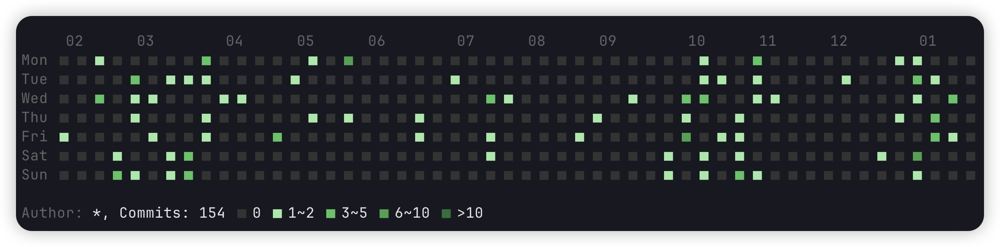

## git-heatmap

A tool to visualize git commit history as a heatmap.

## Usage

git-heatmap add to your `PATH` environment variable

```bash
git heatmap [--email <email-pattern>] [--glyph <glyph>] [/path/to/repo]
```

## screenshot

- common usage example:
  

- square glyph:
  

- fisheye glyph:
  

## Options

```bash
Usage:
  git-heatmap [options]... <repository>

Options:
 -h, --help                      show help info
     --repo <arg>                git repository path
 -e, --email <arg>               author email pattern(default: git config --get user.email)
 -b, --branch <arg>              branch name (default: HEAD)
 -w, --weeks <N>                 the number of display weeks
     --scheme <arg>              color scheme (default: default)
                                 (choices: default,dracula,vibrant)
     --glyph <arg>               heatmap glyph (default: square)
                                 (choices: block,square,dot,fisheye,diamond,plus)
 -d, --debug                     enable debug mode (default: false)


Positionals:
 repository                      alias of --repo
```

## License

no license
